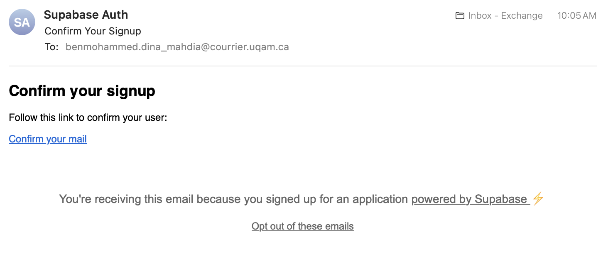
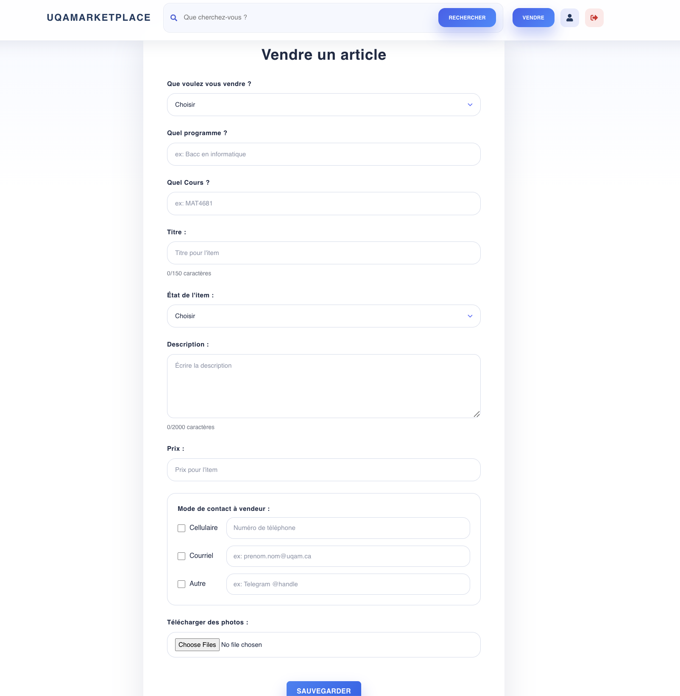
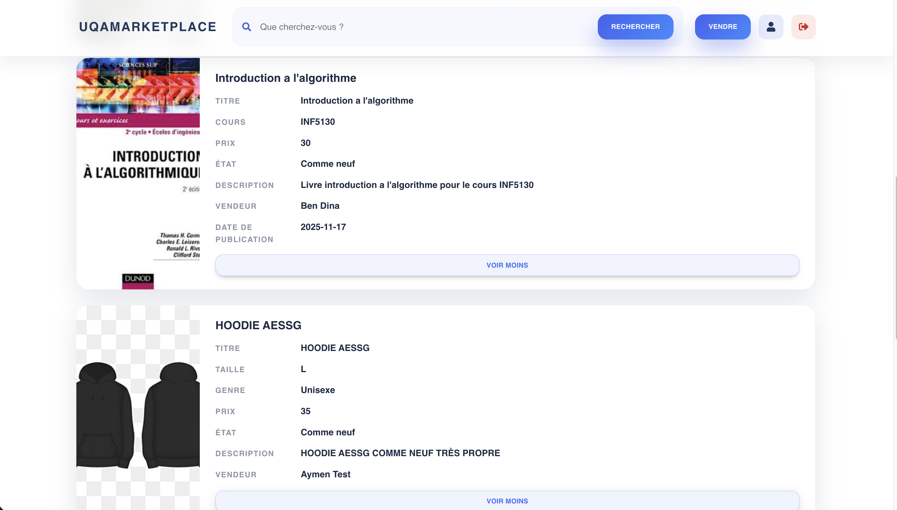

# INF6150 UQAMARKETPLACE Équipe  #8

## Objectif de projet 
Notre équipe a choisi de travailler cette session sur un projet intitulé « UQAMarketplace
». Il s’agit d’une plateforme web destinée aux étudiants de l'UQAM, afin de leur offrir un
espace commun, clair et pratique pour vendre, acheter, échanger ou donner des biens
et services entre membres de la communauté de l’UQAM.
L’accès au système sera réservé aux adresses institutionnelles de l’UQAM, ce qui assure
un cadre de confiance. Une fois inscrits, les utilisateurs pourront créer un profil, publier
des annonces avec photos et consulter celles déjà en ligne grâce à différents filtres de
recherche (catégorie, prix, état, etc.).
Un module de messagerie interne permettra aussi aux acheteurs et vendeurs de
communiquer directement à propos des annonces. Le site sera conçu pour être
utilisable aussi bien sur ordinateur que sur téléphone.
Avec « UQAMarketplace », nous voulons proposer aux étudiants un outil adapté à leur vie
quotidienne, qui facilite les échanges et renforce les liens au sein de la communauté
universitaire.

## Plateforme de planification de travail commune 
- Google document : https://docs.google.com/document/d/1L-CobBIBkGA2hp2uQdm-1rWM1e1K8aGD3Qc6llwNw1A/edit?usp=sharing
- Gitlab issue boards
- Document excel : https://uqam-my.sharepoint.com/:x:/r/personal/ea091990_ens_uqam_ca/_layouts/15/doc2.aspx?sourcedoc=%7B94E56C7F-0D0C-4426-BBB6-6713C15443B4%7D&file=Equipe%238-UqaMarketplace-Liste_Activites-Gabarit.xlsx&action=default&mobileredirect=true&wdOrigin=APPHOME-WEB.DIRECT%2CAPPHOME-WEB.UNAUTH%2CAPPHOME-WEB.SHELL.SIGNIN%2CAPPHOME-WEB.JUMPBACKIN&wdPreviousSession=0dca8338-764c-4f5f-b610-a6fae1e3c252&wdPreviousSessionSrc=AppHomeWeb&ct=1759848408288 

## Technologie
- Frontend : React + JavaScript
- Backend : Node.js + JavaScript
- Base de données : Supabase (s’occupe de l’authentification, backend et base de donnee)
- Stockage d’images : Supabase

## Installation

### Prérequis
- Node.js (>= 16.0.0)
- npm (>= 8.0.0)

### Installation des dépendances

Depuis la racine du projet :
```bash
npm install
```

Cette commande installera automatiquement les dépendances du frontend.

### Structure du projet
```
.
├── frontend/          # Application React
├── package.json       # Scripts racine pour orchestrer le frontend
└── README.md
```

## Usage
La branche Dev est celle utilise et a jour pour le sprint 2. 

### Démarrer l'application

Depuis la racine du projet :
```bash
npm start
```

**Scripts disponibles :**
- `npm start` - Démarrer le frontend
- `npm run build` - Construire le frontend pour la production
- `npm test` - Exécuter les tests du frontend

## Auteurs
Travail réalisé par:

- Abbasi Moghadam, Setayesh
- Benalia, Aymen
- Benmohammed, Dina Mahdia
- Loucif, Adel
- Rhazouani, Houda

## Tp1 statut
- Page wiki Tp1 equipe 8 pdf disponible

## Tp2 statut
- Page wiki Tp2 equipe 8 pdf disponible

## Projet statut
- Tp3 Sprint # 1 fini dans la branche dev et publie dans le wiki
- Tp3 Sprint # 2 en cours dans la branche dev et les branches sprint 2

## But de l'itération Sprint 1
- En tant qu’étudiant de l’UQAM, on peut s’authentifier avec
notre domaine de l’uqam (soit @courrier.uqam.ca, @uqam.ca ou bien
@ens.uqam.ca) ainsi que créer, modifier ou supprimer des annonces.

## But de l'itération Sprint 2
- Voir et mettre des articles en ventes, Recherche avancée (catégories + filtres) et ajustements des bogues et de l'interface utilisateur.

### Apercu de l'interface utilisateur

#### Page de connexion


#### Confirmation du compte uqam par email uqam (authentification) avec Supabase



#### Mise en vente d'un article avec les criteres d'acceptations



#### Page des annonces


